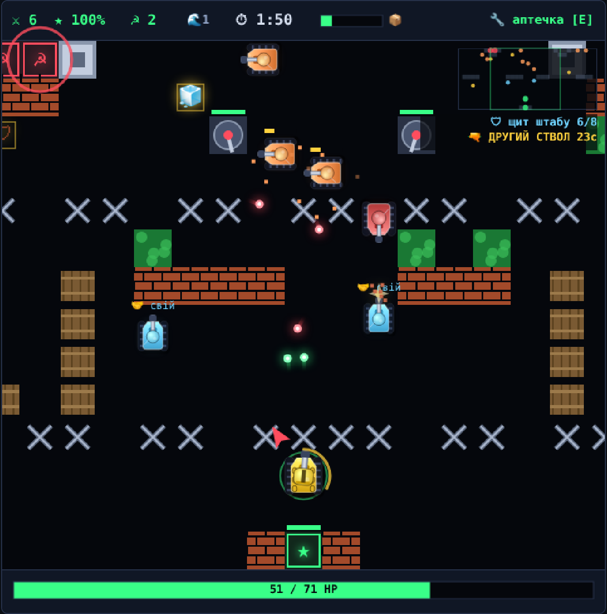
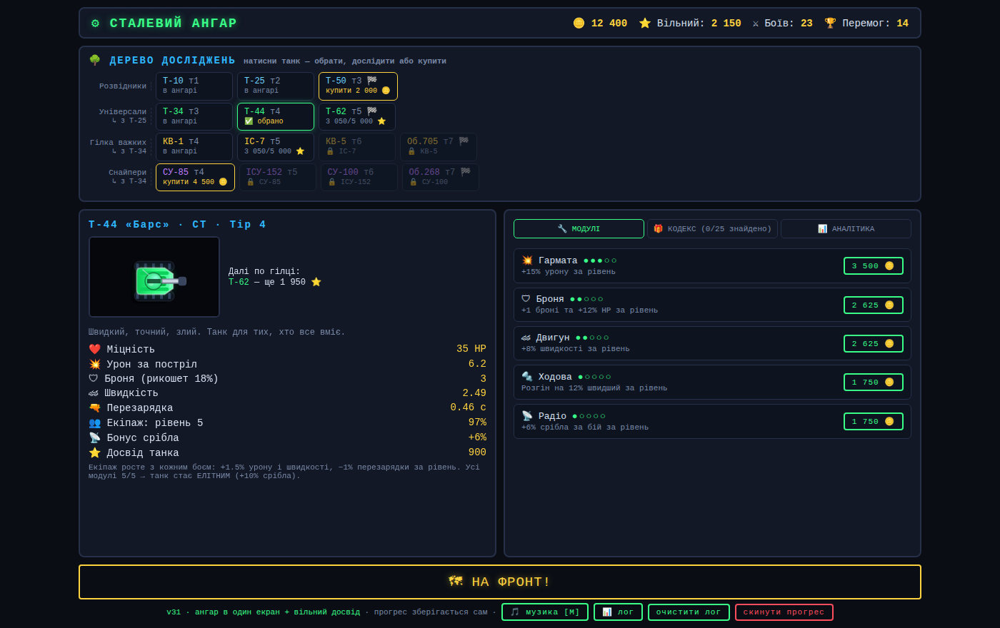
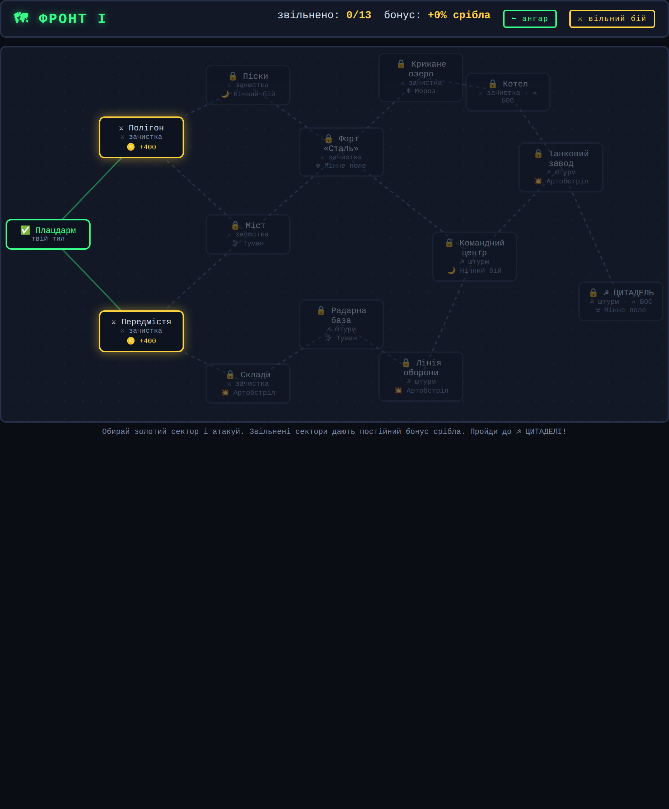
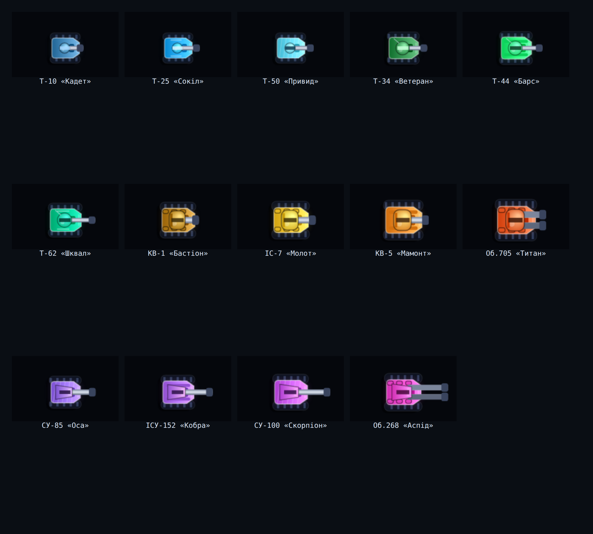
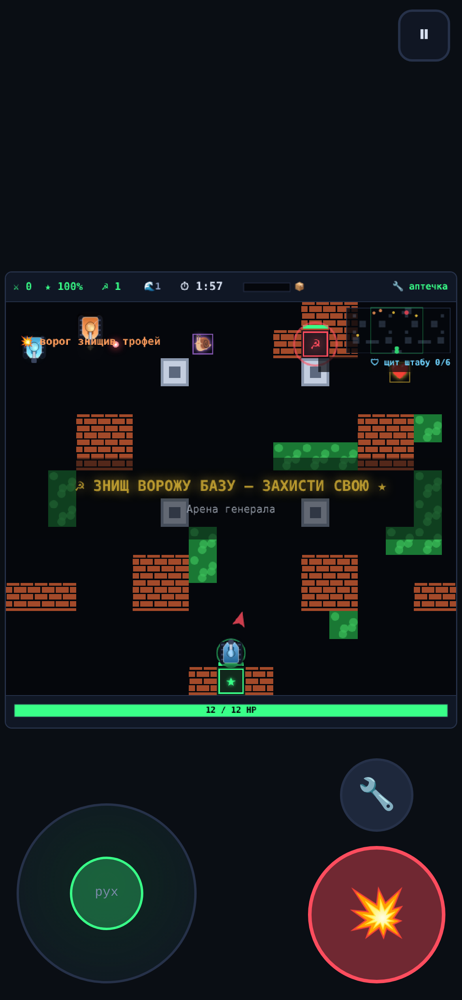

<div align="center">

# ⚙ СТАЛЕВИЙ АНГАР

### Танчики виросли, пішли на війну і почали рахувати срібло.

**Гра про ті двадцять хвилин, які лишились у тебе ввечері.**
Бої по дві хвилини. Ангар, який усе пам'ятає. Дерево досліджень із чотирнадцяти танків.
Без встановлення, без акаунта, без залежностей — один HTML і один JS.

`чистий JS` · `нуль залежностей` · `~190 КБ разом` · `працює з file://` · `комп'ютер + телефон`



</div>

---

<div align="center">

## ▶ [**ГРАТИ В БРАУЗЕРІ**](https://everyway123.github.io/game1/)

[](https://everyway123.github.io/game1/)
[](#як-це-зроблено)
[](#як-це-зроблено)

</div>

## Про що це

Тобі дають задрипаний навчальний танк першого тіру і стільки срібла, що ледве вистачає
на гармату. Попереду — чотирнадцять секторів, ворожий штаб за сталевим щитом і гілка
досліджень, яка закінчується монстром із двома стволами.

Кожен бій — **менше двох хвилин**. Кожен бій щось зрушує в ангарі.
Закривай вкладку коли завгодно — усе зберігається саме.

## Як запустити

**[everyway123.github.io/game1](https://everyway123.github.io/game1/)** — тиснеш і вже в бою.
Нічого встановлювати, без акаунта, без реклами. Працює на телефоні.

Або локально:

```bash
git clone https://github.com/Everyway123/game1.git
open game1/index.html          # усе
```

Жодного збирання. Жодного `npm install`. Просто відкрий файл.

## Що всередині

<table>
<tr><td width="50%">

### 🌳 Чотирнадцять танків, чотири гілки
Розвідники, універсали, важкі, ПТ-САУ — до 7 тіру.
Досвід танка на дослідження, срібло на купівлю,
досвід екіпажу, який тихо покращує все.
Усі модулі 5/5 → танк стає **ЕЛІТНИМ**.

</td><td width="50%">

### 🎁 Двадцять п'ять трофейних коробок
П'ятнадцять — чистий бонус. **Десять чогось коштують.**
Другий ствол, самонаведення, фугаси, автозаряджання —
або Берсерк (урон росте, поки ти стікаєш кров'ю),
Перегрів (стріляєш удвічі швидше, б'єш сам себе),
Лотерея (може випасти будь-що).

</td></tr>
<tr><td>

### 🛡 Раунд із аркою
Ворожий штаб під **сталевим щитом**, поки не виб'єш половину
передового загону. Тож раунд — це не рівний гринд, а спершу
бій за перевагу, потім прорив.

</td><td>

### 🗺 Карти вдвічі ширші за екран
Камера їде за танком, міні-мапа тримає все поле в полі зору.
У кущах тебе не видно. Бочки вибухають ланцюгом. На льоду
заносить. Стіна тримає три постріли, а не один.

</td></tr>
<tr><td>

### 🤝 Союзні пілоти
Рідкісна коробка приводить дружній танк — 60% твоїх HP,
70% урону, і він відтягує вогонь. Знайдеш другу —
поїдете втрьох.

</td><td>

### 🎼 Саундтрек без жодного аудіофайлу
Кінематографічний орган, згенерований на льоту у WebAudio:
конволюційна реверберація на 4.2 с, будується під час запуску,
адитивні органні труби замість пилки, вісімковий остинато
і повільний крещендо через 16 тактів. У бою — щільніше.

</td></tr>
</table>

---

<div align="center">

### Ангар, який усе пам'ятає



### Чотирнадцять секторів від Плацдарму до ☭ Цитаделі



### Чотирнадцять танків, чотирнадцять силуетів



</div>

---

## Дрібниці, заради яких варто гортати

**Кожен бій пише лог сам.** Фраги, отриманий урон, рикошети, обрані доктрини, секунди,
карта, режим — одразу в `localStorage`, з ангара вивантажується як JSON. Панель аналітики
читає це назад: відсоток перемог по танках, по картах, останні десять боїв.

**Баланс тут заміряний, а не відчутий.** Штурм тюнили після 24 контрольованих боїв на режим
на однаковому танку — 63% перемог у зачистці проти 29% у штурмі, тож підняли нагороду,
а не знизили складність. Темп ворожого вогню виставили, рахуючи постріли за секунду пробою,
а не на слух. Музику перебалансували, бо `AnalyserNode` показав, що низька педаль забиває
орган на 43 Гц.

**П'ять модифікаторів бою.** Туман, нічний бій, артобстріл, мінні поля, мороз — кожен
прив'язаний до конкретних секторів кампанії.

**Вороги теж хочуть лут.** Вони звертають за коробкою, а ворог із трофеєм носить значок
над корпусом. Побачив 🛰 над червоним — рушай: у цього снаряди летять за тобою.

---

## Керування

| | Клавіатура | Телефон |
|---|---|---|
| Рух | `WASD` / стрілки | аналоговий джойстик |
| Вогонь | `Пробіл` — куди дивишся, туди й летить | велика 💥, з автоприцілом |
| Аптечка | `E` | 🔧 |
| Пауза | `Esc` | ⏸ |
| Музика | `M` | — |

На телефоні ангар збирається в одну колонку, **НА ФРОНТ** закріплена внизу екрана,
а кампанія показується вертикальним списком замість мапи.

<div align="center">

</div>

---

## Як це зроблено

Два файли. `index.html` — ангар, мапа кампанії й оверлеї; `game.js` — усе інше,
близько 3 800 рядків. Canvas 2D для малювання, WebAudio для кожного звуку
(усе синтезується, жодних семплів), `localStorage` для збережень із міграцією старих.

Без фреймворка, без збирача, без папки ассетів. Танки намальовані шляхами й градієнтами,
вибухи — частинки, реверберація — шумовий буфер зі степеневим згасанням.

```
game1/
├── index.html      інтерфейс ангара, мапа фронту, оверлеї, стилі
├── game.js         ігровий цикл, ШІ, рендер, звук, збереження
└── docs/           скріншоти
```

## Внесок

Баг-репорти вітаються — особливо з прикладеним експортом лога боїв, заради цього
логування й робилось. Хочеш додати танк, карту чи коробку — це звичайні дані
на початку `game.js` (`TANKS`, `MAPS`, `CRATES`), додати одну штуку це кілька рядків.

---

<div align="center">

**[🇬🇧 English description →](README.md)**

Зроблено з [Claude Code](https://claude.com/claude-code).

</div>
